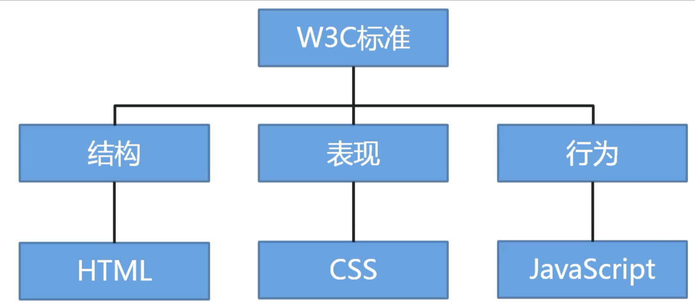
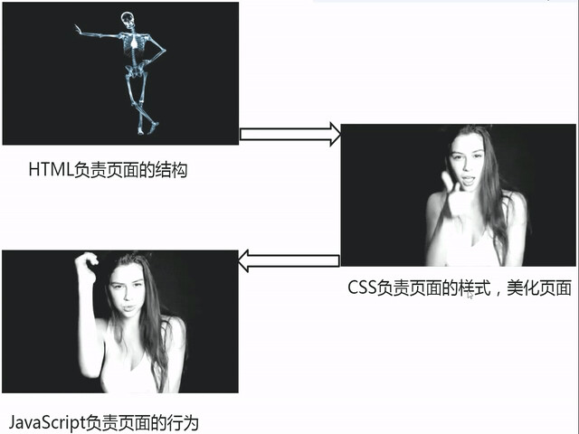

# HTML简介

## 1.网页

### 1.1 什么是网页？

**网站：**利用前端技术制作的网页集合。

**网页：**构成网站的基本元素，通常是 HTML 格式的文件（.htm 或 .html）必须通过浏览器来阅读。

### 1.2 什么是HTML?

**超文本：**由图片、声音、动画、视频……构成且可以相互链接的文本。

**HTML：**超文本标记语言（HTML 不是编程语言，而是由一套标记标签构成的标记语言）。

### 1.3 网页的形成

前端代码开发 ——> 浏览器解析、渲染代码 ——> 呈现 Web 页面。

### 1.4Web标准的构成

**主要包括三个方面：** `结构`、`表现`、`行为`。



**结构html**  

结构是页面的整体结构，哪里是标题，哪里是段落，哪里是图片  
结构使用HTML来编写  

```html  
<!DOCTYPE html>  
<html>  
    <head>  
        <meta charset="utf-8"/>  
        <title></title>  
    </head>  
    <body>  
    </body>  
</html>  
```

**表现css**  

表现是页面的外在的样式，比如字体，字体大小，字体颜色，背景...  
使用CSS来设置页面中元素的样式  

**行为js**  

页面和用户之间的交互行为  
使用JavaScript来设置页面的行为  
一个设计优良的网页要求结构、表现、行为三者分离  
在开发中总是要面临一个问题，就是程序之间的耦合，三者分离就是为了解耦合  




**Web 标准提出的最佳体验方案：** `结构`、`样式`、`行为` 相互分离。

- **简单的理解：**结构写到 `.html` 文件中、表现写到 `.css` 文件中、行为写到 `.js` 文件中
- **一句话解释：**结构类似身体、表现类似衣服、行为类似动作（结构始终是一切的基础！）

## 2.字符编码

所有的数据在计算机中存储时都是以二进制形式存储的，文字也不例外。

所以一段文字在存储到内存中时，都需要转换为二进制编码当我们读取这段文字时，计算机会将编码转换为字符，供我们阅读

### 2.1 编码

将字符转换为二进制码的过程称为编码

### 2.2 解码

将二进制码转换为字符的过程称为解码

### 2.3 字符集（charset）

编码和解码所采用的规则称为字符集（相当于密码本）

### 2.4 乱码

如果编码和解码所采用的字符集不同就会出现乱码问题。

可以通过meta标签来设置网页的字符集，避免乱码问题

```html
<meta charset="utf-8">
```

## 3.字符集

**字符集：**多个字符的集合，以便计算机能够识别和储存各种文字。

### 3.1 ASCII

ASCII(American Standard Code for Information Interchange)：美国信息交换标准代码

在所有字符集中，最知名的可能要数被称为ASCII的8位字符了。美国信息交换标准代码是由美国国家标准学会(American National Standard Institute , ANSI )制定的，是一种标准的单字节字符编码方案，用于基于文本的数据。它最初是美国国家标准，供不同计算机在相互通信时用作共同遵守的西文字符编码标准，后来它被国际标准化组织（International Organization for Standardization, ISO）定为国际标准，称为ISO 646标准。适用于所有拉丁文字字母

ASCII 码使用指定的7 位或8 位二进制数组合来表示128 或256 种可能的字符。标准ASCII 码也叫基础ASCII码，使用7 位二进制数（剩下的1位二进制为0）来表示所有的大写和小写字母，数字0 到9、标点符号，以及在美式英语中使用的特殊控制字符

ASCII码表：[Ascii Table - ASCII character codes and html, octal, hex and decimal chart conversion](http://www.asciitable.com/)

### 3.2 ISO-8859-1

ISO-8859-1编码是单字节编码，向下兼容ASCII，其编码范围是0x00-0xFF，0x00-0x7F之间完全和ASCII一致，0x80-0x9F之间是控制字符，0xA0-0xFF之间是文字符号。

ISO码表：[HTML ISO-8859-1 参考手册](https://www.w3school.com.cn/charsets/ref_html_8859.asp)

### 3.3 GB2312

GB2312（信息交换用汉字编码字符集）是由中国国家标准总局1980年发布。基本集共收入汉字6763个和非汉字图形字符682个。GB 2312的出现，基本满足了汉字的计算机处理需要，它所收录的汉字已经覆盖中国大陆99.75%的使用频率。

### 3.4 GBK

GBK（即“国标”、“扩展”汉语拼音的第一个字母），汉字编码字符集。2000年已被GB18030-2000国家强制标准替代。 2005年GB18030-2005发布，替代了GB18030-2000。

GBK使用了双字节编码方案，其编码范围从8140至FEFE（剔除xx7F），共23940个码位，共收录了21003个汉字，完全兼容GB2312-80标准，支持国际标准ISO/IEC10646-1和国家标准GB13000-1中的全部中日韩汉字，并包含了BIG5编码中的所有汉字。

### 3.5 Big5

Big5，又称为大五码或五大码，是使用繁体中文（正体中文）社区中最常用的电脑汉字字符集标准，共收录13,060个汉字。

Big5虽普及于台湾、香港与澳门等繁体中文通行区，但长期以来并非当地的国家/地区标准或官方标准，而只是业界标准。倚天中文系统、Windows繁体中文版等主要系统的字符集都是以Big5为基准，但厂商又各自增加不同的造字与造字区，派生成多种不同版本。

### 3.6 UTF-8

UTF-8（8位元，Universal Character Set/Unicode Transformation Format）是针对Unicode的一种可变长度字符编码，也叫万国码、统一码。它可以用来表示Unicode标准中的任何字符，而且其编码中的第一个字节仍与ASCII相容，使得原来处理ASCII字符的软件无须或只进行少部分修改后，便可继续使用。

### 3.7 UTF-16

UTF-16是Unicode的其中一个使用方式。UTF-16比起UTF-8，好处在于大部分字符都以固定长度的字节（2字节）储存，但UTF-16却无法兼容于ASCII编码。

### 3.8 Unicode

Unicode只是一组字符设定或者说是从数字和字符之间的逻辑映射的概念编码，但是它并没有指定代码点如何在计算机上存储。UCS4、UTF-8、UTF-16（UTF后的数字代表编码的最小单位，如UTF-8表示最小单位1字节，所以它可以使用1、2、3字节等进行编码，UTF-16表示最小单位2字节，所以它可以使用2、4字节进行编码）都是Unicode的编码方案。UTF-8因可以兼容ASCII而被广泛使用。

**如果把各种文字编码形容为各地的方言，那么Unicode就是世界各国合作开发的一种语言。**

### 3.9 字符集使用

在 `<head>` 标签内，可以通过 `<meta>` 标签的 `charset` 属性来规定 HTML 文档应该使用哪种字符编码。

```html
<meta charset="UTF-8">
```

`charset` 常用的值有：`GB2312`、`BIG5`、`GBK`、`UTF-8`，其中 `UTF-8` 也被称为：万国码，基本包含了全世界所有国家需要用到的字符。

**注意：**字符设置是必须的，否则极大可能引起网页乱码。一般情况下，统一使用 "UTF-8" 编码，尽量统一写成标准的 `UTF-8`，不要写成 "utf8" 或 "UTF8"。

**标准骨架：**

```html
<!doctype html>
<html lang="en">

<head>
    <meta charset="UTF-8">
    <title>Title</title>
</head>

<body>
</body>

</html>
```

### 3.10 IE 兼容模式

IE 支持通过特定的 `<meta>` 标签来确定绘制当前页面所应该采用的 IE 版本。除非有强烈的特殊需求，否则最好是设置为 **edge mode**，从而通知 IE 采用其所支持的最新的绘制模式。

```html
<!doctype html>
<html lang="en">

<head>
    <meta charset="UTF-8">
    <meta http-equiv="x-ua-compatible" content="ie=edge">
    <title>Title</title>
</head>

<body>
</body>

</html>
```

## 4.文档声明（doctype）

`<!doctype>` 文档类型声明，作用是告诉浏览器应该使用哪种 HTML 版本来解析渲染网页。

```html
<!doctype html>
<!-- 当前页面采用 HTML5 版本 -->
```

**注意：**

- `<!doctype>` 声明位于文档最前面的位置，处于 \<html> 标签之前
- `<!doctype>` 文档类型声明标签，不属于 HTML 标签
- 请默认统一指定 HTML5 版本 `<!doctype html>`

## 5.lang语言种类

用来定义当前网页显示的主语言，书写在 `<html>` 标签内。

- `en` 定义语言为英语
- `zh` 定义语言为中文

简单来说：定义为 `en` 就是面向英文用户的网页，定义为 `zh` 就是面向中国大陆用户的网页。

> `en-GB` 英文（英国）
>
> `en-US` 英文（美国）
>
> `zh-CN` 中文（简体，中国大陆）
>
> `zh-SG` 中文（简体，新加坡）
>
> `zh-HK` 中文（繁体，香港）
>
> `zh-MO` 中文（繁体，澳门）
>
> `zh-TW` 中文（繁体，台湾）

```html
<html lang="zh-CN"> 
</html>
```

> 语言的设置是为了方便 `浏览器搜索推荐` 以及触发 `浏览器翻译功能`，并不是说设置了某类主语言后网页中就不能存在其他类型的语言了。

## 6.HTML语法规范

### 6.1 基本语法概述

HTML 标签是由**尖括号**包围的关键字词，例如：`<html>`。

HTML 标签通常是成对出现的，例如：`<html>` 和 `</html>`，我们称为**双标签**。标签对中的第一个标签是**开始标签**，第二个标签是**结束标签**。

有些特殊的标签必须是单个标签，例如：`<br />`，我们称为**单标签**。注意：`/` 之前有一个空格（Coding Style 编码风格）。每个标签原则上都应该有**结束符**，即：` /`。所以单标签的最后要加 `/` 以表示结束，当然不加也是可以被浏览器正常解析的。

> HTML5 规范中明确说明单标签 `/` 是可以忽略的，**实际开发中建议不要给单标签添加斜线**。

> 任何标签都建议不要大写，即便是 `<!doctype html>` 标签。

### 6.2 标签关系

1. **包含关系**

```html
<head>
    <title></title>
</head>
```

2. **并列关系**

```html
<head>
</head>
<body> 
</body>
```

## 7.HTML5的基本结构

```html
<!-- 文档声明，声明当前网页的版本 -->
<!doctype html>
<!-- html的根标签（元素），网页中的所有内容都要写根元素的里边 -->
<html>
    <!-- head是网页的头部，head中的内容不会在网页中直接出现，主要用来帮助浏览器或搜索引擎来解析网页 -->
    <head>
        <!-- meta标签用来设置网页的元数据，这里meta用来设置网页的字符集，避免乱码问题 -->
        <meta charset="utf-8">
        <!-- title中的内容会显示在浏览器的标题栏，搜索引擎会主要根据title中的内容来判断网页的主要内容 -->
        <title>网页的标题</title>
    </head>
    <!-- body是htm1的子元素，表示网页的主体，网页中所有的可见内容都应该写在body里 -->
    <body>
        <!-- h1网页的一级标题 -->
        <h1>网页的大标题</h1>
    </body>
</html>
```

`<!doctype html>`文档声明  
用来标识当前页面的html的版本  
该声明用来告诉浏览器，当前的页面是使用HTML5的标准编写的  
`<html>`网页的根标签   
一个页面中有且只有一个根标签  
网页中的所有内容都需要写在html标签的内部  

`<head>`网页的头部  

该标签中的内容不会在网页中直接显示  
该标签用于帮助浏览器解析页面  
子标签  
`<title>`用来设置网页的标题   
默认会在浏览器的标题栏中显示  
搜索引擎检索网页时，会主要检索title中的内容，它会影响到页面在搜索引擎中的排名  
`<meta>`  
用来设置网页的元数据，比如网页使用的字符集  
`<meta charset="utf-8" />`  
设置网页的关键字  
`<meta name="keywords" content="关键字,关键字,关键字,关键字"/>`  
设置网页的描述  
`<meta name="description" content="网页的描述"/>`  
请求的重定向  
`<meta http-equiv="refresh" content="秒数;url=地址"  />`  