# 2D转换 3D转换 浏览器私有前缀

## 1.2D转换

转换（transform）是 CSS3 中具有颠覆性的特征之一。可以实现元素的位移、旋转、缩放等效果。

转换（transform）你可以简单理解为变形。变形就是指通过css来改变元素的形状或位置，变形不会影响到页面的布局,`transform`用来设置元素的变形效果。

- 移动：translate
- 旋转：rotate
- 缩放：scale

### 1.1 二维坐标系

2D 转换是改变标签在二维平面上的位置和形状的一种技术，先来学习二维坐标系。

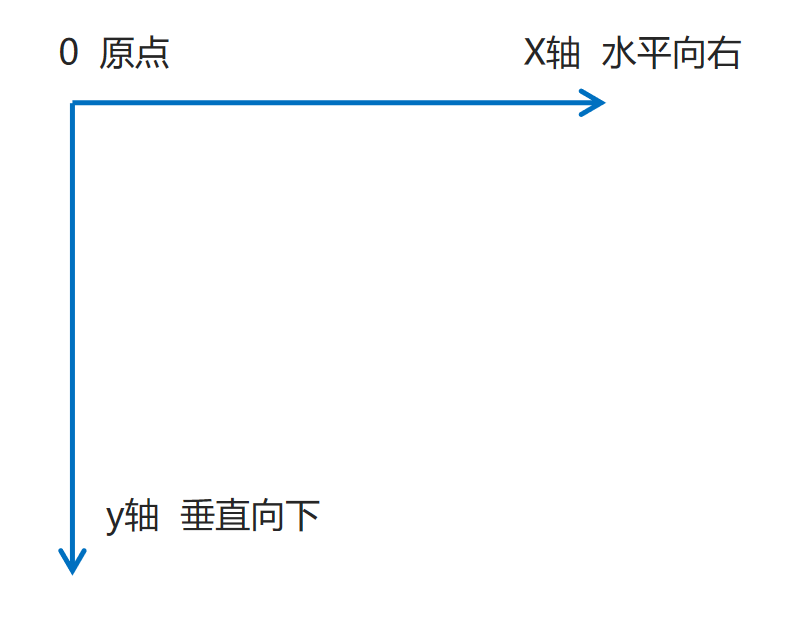

### 1.2 2D转换之移动 translate

2D 移动是 2D 转换里面的一种功能，可以改变元素在页面中的位置，类似定位。

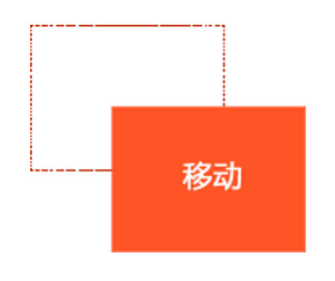

语法：

```css
transform: translate(x, y); 
/* 或者分开写 */
transform: translateX(n);
transform: translateY(n);
```

重点：

- 定义 2D 转换中的移动，沿着 X 和 Y 轴移动元素
- translate 最大的优点：**不会影响到任何其他元素的位置**（优于定位的地方）
- translate 中的百分比单位是**相对于自身**元素的 translate: (50%, 50%);
- **对行内元素没有效果**

```html
<!doctype html>
<html lang="en">

<head>
    <meta charset="UTF-8">
    <meta name="viewport" content="width=device-width, initial-scale=1.0">
    <meta http-equiv="X-UA-Compatible" content="ie=edge">
    <title>2D转换之移动translate</title>
    <style>
        /* 移动盒子的位置：定位、盒子的外边距、2D转换移动 */

        div {
            width: 200px;
            height: 200px;
            background-color: hotpink;
            /* x就是x轴上移动位置，y就是y轴上移动位置，中间用逗号分隔 */
            /* transform: translate(x, y); */
            /* transform: translate(100px, 100px); */
            /* 1. 只移动x坐标 */
            /* transform: translate(100px, 0); */
            /* transform: translateX(100px); */
            /* 2. 只移动y坐标 */
            /* transform: translate(0, 100px); */
            /* transform: translateY(100px); */
        }

        div:first-child {
            transform: translate(30px, 30px);
        }

        div:last-child {
            background-color: black;
        }
    </style>
</head>

<body>
    <div></div>
    <div></div>
</body>

</html>
```

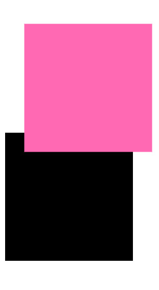

```html
<!doctype html>
<html lang="en">

<head>
    <meta charset="UTF-8">
    <meta name="viewport" content="width=device-width, initial-scale=1.0">
    <meta http-equiv="X-UA-Compatible" content="ie=edge">
    <title>让一个盒子水平居中</title>
    <style>
        * {
            margin: 0;
            padding: 0;
        }
        
        div {
            position: relative;
            width: 500px;
            height: 500px;
            background-color: hotpink;
            /* 1. 我们 tranlate 里面的参数是可以用 % */
            /* 2. 如果里面的参数是 % 那么移动的距离是以盒子自身的宽度或者高度来对比的 */
            /* 这里的 50% 就是 250px 因为盒子的宽度是 500px */
            /* transform: translateX(50%); */
        }

        p {
            position: absolute;
            top: 50%;
            left: 50%;
            width: 200px;
            height: 200px;
            background-color: black;
            /*
            在前面的定位中使用直接减去自身宽度与高度的一半，此种方式的缺点在于不能随盒子大小的变化而变化
            margin-top: -100px;
            margin-left: -100px;
            */
            transform: translate(-50%, -50%);
        }

        span {
            /* translate 对于行内元素是无效的 */
            transform: translate(300px, 300px);
        }
    </style>
</head>

<body>
<div>
    <p></p>
</div>
<span>123</span>
</body>

</html>
```

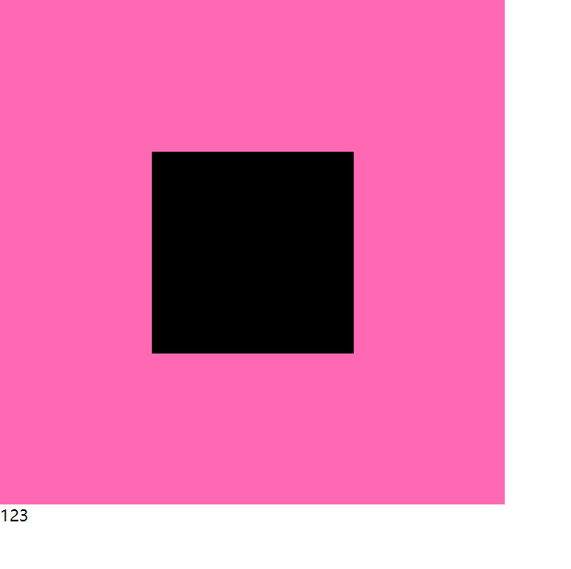

### 1.3 2D转换之旋转 rotate

2D 旋转指的是让元素在 2 维平面内顺时针旋转或者逆时针旋转。

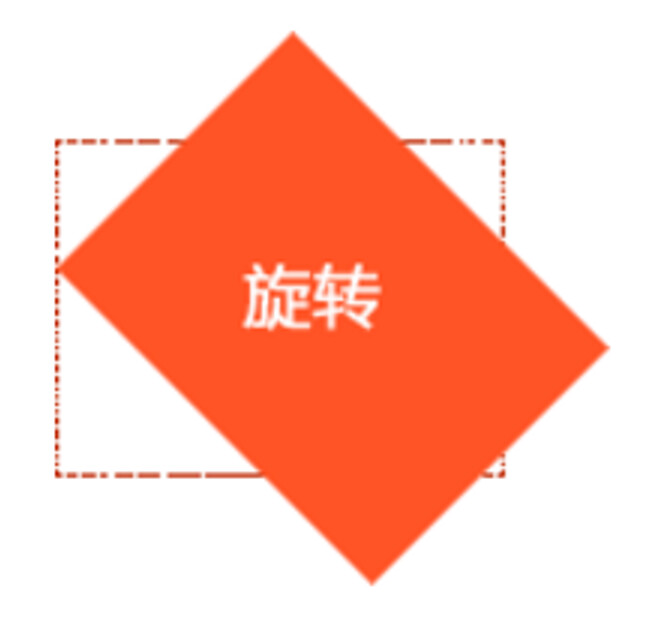

语法：

```css
transform: rotate(度数)
```

重点：

- rotate 里面跟度数，单位是 deg，比如 rotate(45deg)
- 角度为正时，顺时针；负时，逆时针
- 默认旋转的中心点是元素的中心点

```html
<!doctype html>
<html lang="en">

<head>
    <meta charset="UTF-8">
    <meta name="viewport" content="width=device-width, initial-scale=1.0">
    <meta http-equiv="X-UA-Compatible" content="ie=edge">
    <title>2D转换之旋转rotate</title>
    <style>
        img {
            width: 150px;
            /* 顺时针旋转45度 */
            /* transform: rotate(45deg); */
            border-radius: 50%;
            border: 5px solid pink;
            /* 过渡写到本身上，谁做动画给谁加 */
            transition: all 0.5s;
        }

        img:hover {
            transform: rotate(360deg);
        }
    </style>
</head>

<body>

</body>

</html>
```

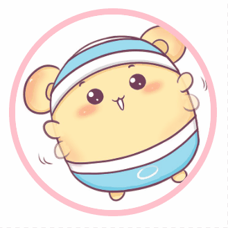

```html
<!doctype html>
<html lang="en">

<head>
    <meta charset="UTF-8">
    <meta name="viewport" content="width=device-width, initial-scale=1.0">
    <meta http-equiv="X-UA-Compatible" content="ie=edge">
    <title>旋转三角</title>
    <style>
        div {
            position: relative;
            width: 249px;
            height: 35px;
            border: 1px solid #000;
        }

        /* 三角可以通过盒子来制作，不一定非得字体图标 */
        /* 让一个旋转45度的正方形（菱形）的两个边框显示出来 */
        div::after {
            content: "";
            position: absolute;
            top: 8px;
            right: 15px;
            width: 10px;
            height: 10px;
            border-right: 1px solid #000;
            border-bottom: 1px solid #000;
            transform: rotate(45deg);
            transition: all 0.2s;
        }

        /* 鼠标经过 div 里面的三角旋转 */
        div:hover::after {
            transform: rotate(225deg);
        }
    </style>
</head>

<body>
<div></div>
</body>

</html>
```

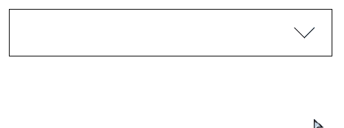

### 1.4 转换中心点 transform-origin

我们可以设置元素转换的中心点。

语法：

```css
transform-origin: x y;
```

重点：

- 注意后面的参数 x 和 y 用空格隔开
- x y 默认转换的中心点是元素的中心点（50% 50%）
- 还可以给 x y 设置 像素 或者 方位名词（top  bottom  left  right  center）

```html
<!doctype html>
<html lang="en">

<head>
    <meta charset="UTF-8">
    <meta name="viewport" content="width=device-width, initial-scale=1.0">
    <meta http-equiv="X-UA-Compatible" content="ie=edge">
    <title>transform-origin</title>
    <style>
        div {
            width: 100px;
            height: 100px;
            background-color: pink;
            margin: 100px auto;
            transition: all 1s;
            /* 1.可以跟方位名词 */
            /* transform-origin: left bottom; */
            /* 2. 默认的是 50% 50% 等价于 center center */
            /* 3. 可以是 px 像素 */
            transform-origin: 25px 25px;
        }

        div:hover {
            transform: rotate(360deg);
        }
    </style>
</head>

<body>
<div></div>
</body>

</html>
```

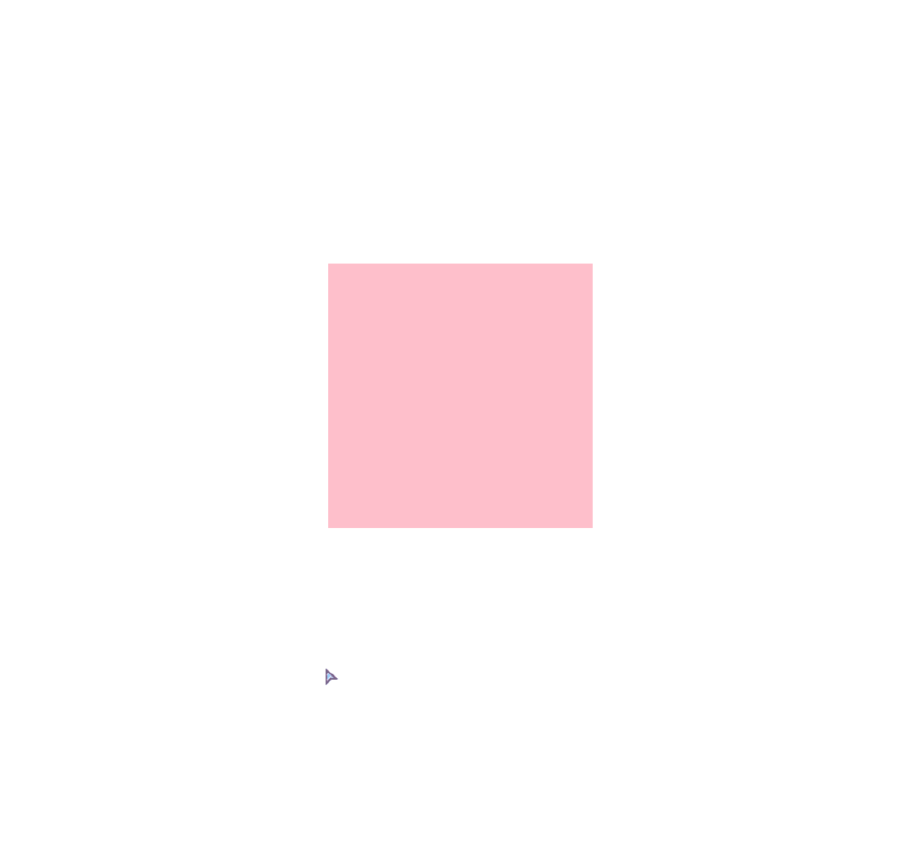

```html
<!doctype html>
<html lang="en">

<head>
    <meta charset="UTF-8">
    <meta name="viewport" content="width=device-width, initial-scale=1.0">
    <meta http-equiv="X-UA-Compatible" content="ie=edge">
    <title>旋转中心点</title>
    <style>
        div {
            /* 溢出隐藏 */
            overflow: hidden;
            width: 200px;
            height: 200px;
            border: 1px solid pink;
            margin: 10px;
            float: left;
        }

        div::before {
            content: "黑马";
            display: block;
            width: 100%;
            height: 100%;
            background-color: hotpink;
            transform: rotate(180deg);
            transform-origin: left bottom;
            transition: all 0.4s;
        }

        /* 鼠标经过 div 里面的 before 复原 */
        div:hover::before {
            transform: rotate(0deg);
        }
    </style>
</head>

<body>
<div></div>
<div></div>
<div></div>
</body>

</html>
```

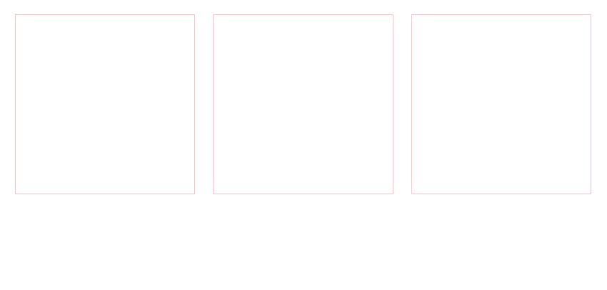

### 1.5 2D 转换之缩放 scale

缩放，顾名思义，可以放大和缩小。只要给元素添加上了这个属性就能控制它放大还是缩小。

语法：

```css
transform: scale(x, y);
```

注意：

- 注意其中的 x 和 y 用逗号分隔
- transform: scale(1, 1) ：宽和高都放大一倍，相当于没有放大
- transform: scale(2, 2) ：宽和高都放大了 2 倍
- transform: scale(2) ：只写一个参数，第二个参数默认等于第一个参数，相当于 scale(2, 2)
- transform: scale(0.5, 0.5) ：缩小
- scale 缩放最大的优势：可以设置缩放的基准点（默认以中心点缩放）；并且缩放不会影响其他盒子的位置（以上两个特点都是直接设置 width 和 height 都无法做到的）

```html
<!doctype html>
<html lang="en">

<head>
    <meta charset="UTF-8">
    <meta name="viewport" content="width=device-width, initial-scale=1.0">
    <meta http-equiv="X-UA-Compatible" content="ie=edge">
    <title>2D转换之缩放</title>
    <style>
        div {
            width: 200px;
            height: 200px;
            background-color: pink;
            margin: 100px auto;
            /* 可以设置缩放的中心点 */
            /* transform-origin: left bottom; */
        }
        
        div:hover {
            /* 1. 里面写的数字不跟单位 就是倍数的意思， 1 就是 1 倍；2 就是 2 倍 */
            /* transform: scale(x, y); */
            /* transform: scale(2, 2); */
            /* 2. 修改了宽度为原来的 2 倍，高度不变 */
            /* transform: scale(2, 1); */
            /* 3. 等比例缩放 同时修改宽度和高度，我们有简单的写法以下是宽度修改了 2 倍，高度默认和第一个参数一样 */
            /* transform: scale(2); */
            /* 4. 我们可以进行缩小，小于 1就是缩小 */
            /* transform: scale(0.5, 0.5); */
            /* transform: scale(0.5); */
            /* 5. scale 的优势之处：不会影响其他的盒子，而且可以设置缩放的中心点 */
            /*
            直接设置宽高时无法做到以上优点的！
            width: 300px;
            height: 300px;
            */
            transform: scale(2);
        }
    </style>
</head>

<body>
    <div></div>
</body>

</html>
```

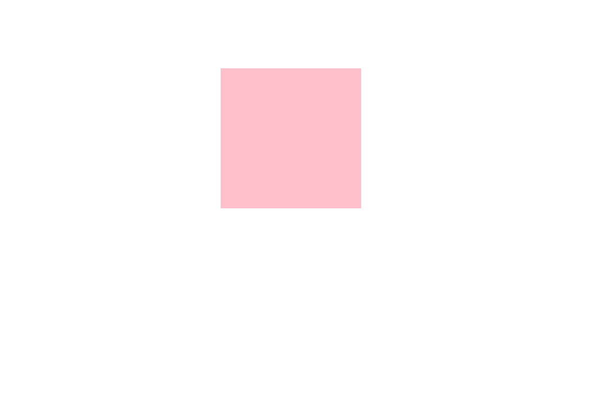

```html
<!doctype html>
<html lang="en">

<head>
    <meta charset="UTF-8">
    <meta name="viewport" content="width=device-width, initial-scale=1.0">
    <meta http-equiv="X-UA-Compatible" content="ie=edge">
    <title>图片放大案例</title>
    <style>
        div {
            width: 225px;
            height: 137px;
            overflow: hidden;
            float: left;
            margin: 10px;
        }

        div img {
            transition: all .4s;
        }

        div img:hover {
            transform: scale(1.1);
        }
    </style>
</head>

<body>
<div>
    <a href="#"></a>
</div>
<div>
    <a href="#"></a>
</div>
<div>
    <a href="#"></a>
</div>
</body>
 
</html>
```

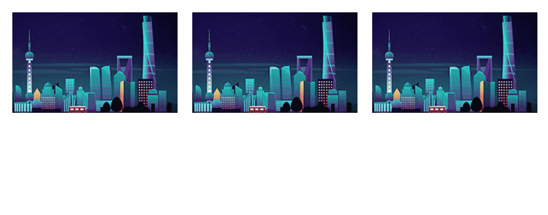

```html
<!doctype html>
<html lang="en">

<head>
    <meta charset="UTF-8">
    <meta name="viewport" content="width=device-width, initial-scale=1.0">
    <meta http-equiv="X-UA-Compatible" content="ie=edge">
    <title>Document</title>
    <style>
        li {
            float: left;
            width: 30px;
            height: 30px;
            border: 1px solid hotpink;
            margin: 10px;
            text-align: center;
            line-height: 30px;
            list-style: none;
            border-radius: 50%;
            cursor: pointer;
            transition: all .4s;
        }

        li:hover {
            transform: scale(1.2);
        }
    </style>
</head>

<body>
<ul>
    <li>1</li>
    <li>2</li>
    <li>3</li>
    <li>4</li>
    <li>5</li>
    <li>6</li>
    <li>7</li>
</ul>
</body>

</html>
```


### 1.6 2D 转换综合写法

注意：

1. 同时使用多个转换，其格式为：`transform: translate() rotate() scale()` ...等
2. 其顺序会影转换的效果。（先旋转会改变坐标轴方向）
3. 当我们同时有位移和其他属性的时候，记得要将**位移放到最前**

```html
<!doctype html>
<html lang="en">

<head>
    <meta charset="UTF-8">
    <meta name="viewport" content="width=device-width, initial-scale=1.0">
    <meta http-equiv="X-UA-Compatible" content="ie=edge">
    <title>Document</title>
    <style>
        div {
            width: 200px;
            height: 200px;
            background-color: pink;
            transition: all 1s;
        }

        div:hover {
            /* transform: rotate(180deg) translate(150px, 50px); */
            /* 我们同时有位移和其他属性，我们需要把位移放到最前面 */
            transform: translate(150px, 50px) rotate(180deg) scale(1.2);
        }
    </style>
</head>

<body>
<div></div>
</body>

</html>
```

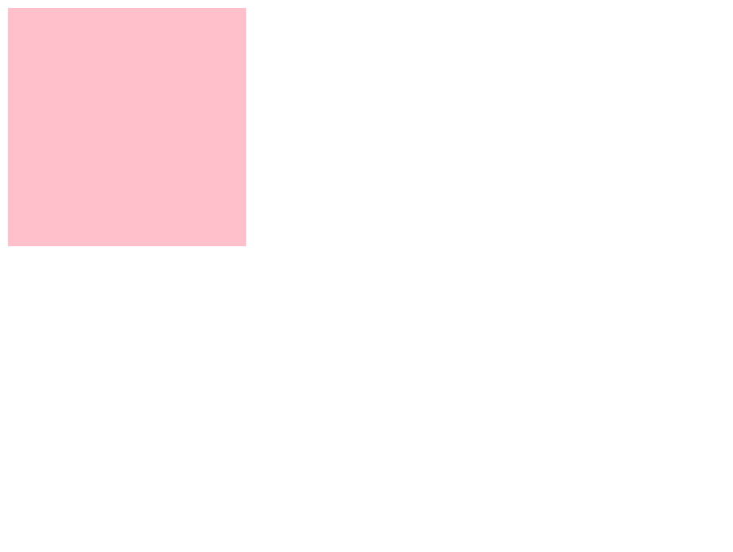

### 1.7 2D 转换总结

- 转换 transform 我们简单理解就是变形，有 2D 和 3D 之分
- 我们暂且学了三个，分别是：位移、旋转 和 缩放
- 2D 移动 translate(x, y) 最大的优势是不影响其他盒子，里面参数用 %，是相对于自身宽度和高度来计算的
- 可以分开写比如 translateX(x)  和 translateY(y)
- 2D 旋转 rotate(度数) 可以实现旋转元素，度数的单位是 deg
- 2D 缩放 sacle(x, y) 里面参数是数字，不跟单位，可以是小数。最大的优势在于不影响其他盒子
- 设置转换中心点 transform-origin : x y; 参数可以百分比、像素或者是方位名词
- 当我们进行综合写法，同时有位移和其他属性的时候，记得要将位移放到最前

## 2.3D转换

我们生活的环境是 3D 的，照片就是 3D 物体在 2D 平面呈现的例子。

**有什么特点**

- 近大远小
- 物体后面遮挡不可见

当我们在网页上构建 3D 效果的时候参考这些特点就能产出 3D 效果。

### 2.1 三维坐标系

三维坐标系其实就是指立体空间，立体空间是由3个轴共同组成的。

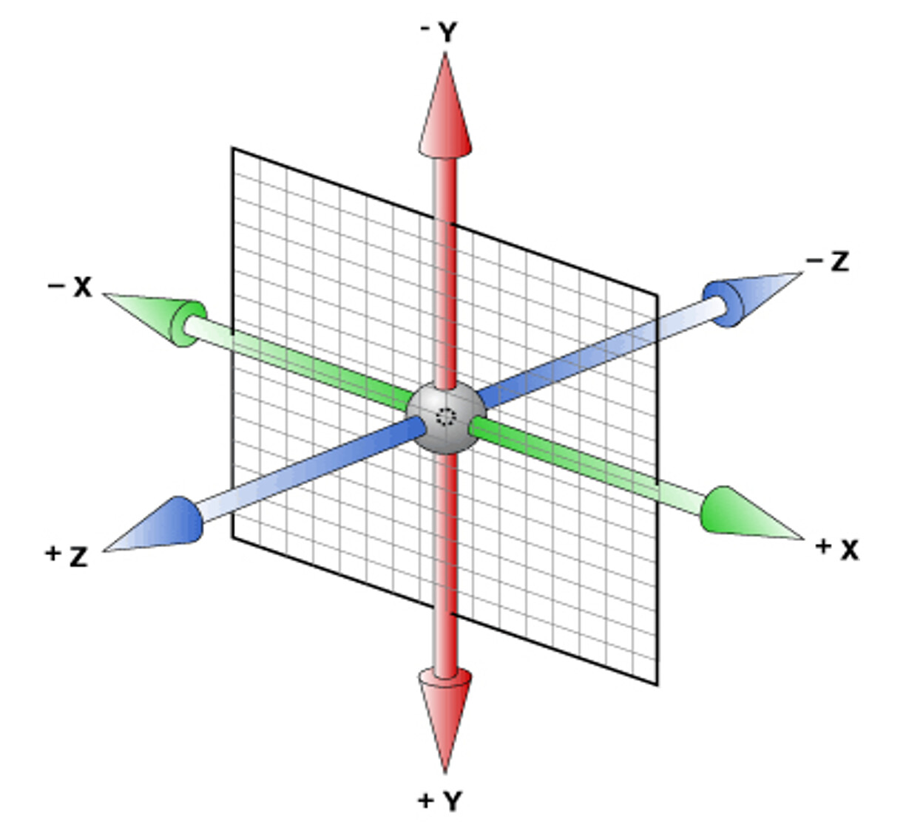

- x 轴：水平向右（注意：x 右边是正值，左边是负值）
- y 轴：垂直向下（注意：y 下面是正值，上面是负值）
- z 轴：垂直屏幕（注意：往外面是正值，往里面是负值）

**3D 转换我们主要学习工作中最常用的 3D 位移 和 3D 旋转。**

**主要知识点**

- 3D 位移：translate3d(x, y, z)
- 3D 旋转：rotate3d(x, y, z)
- 透视：perspective
- 3D 呈现：transfrom-style

### 2.2 3D移动 translate3d

3D 移动在 2D 移动的基础上多加了一个可以移动的方向，就是 z 轴方向。

- transform:translateX(100px)：仅仅是在 X 轴上移动
- transform:translateY(100px)：仅仅是在 Y 轴上移动
- transform:translateZ(100px)：仅仅是在 Z 轴上移动（注意：translateZ 一般用 px 单位）
- transform:translate3d(x, y, z)：其中 x、y、z 分别指要移动的轴的方向的距离

因为 z 轴是垂直屏幕，由里指向外面，所以默认是看不到元素在 z 轴的方向上移动（要借助透视）。

### 2.3 透视 perspective

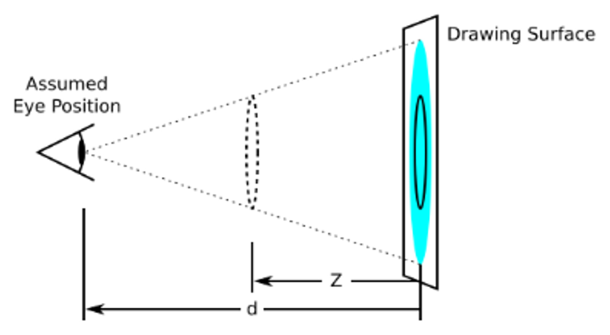


在 2D 平面产生近大远小视觉立体，但是效果只是二维的。

- 如果想要在网页产生 3D 效果需要透视（理解成 3D 物体投影在 2D 平面内）
- 模拟人类的视觉位置，可认为安排一只眼睛去看
- 透视我们也称为视距：视距就是人的眼睛到屏幕的距离
- 距离视觉点越近的，在电脑平面成像越大，越远成像越小
- 透视的单位是像素

**透视写在被观察元素的父盒子上面。**

d：就是视距，视距就是一个距离人的眼睛到屏幕的距离。

z：就是 z 轴，物体距离屏幕的距离，z 轴越大（正值）我们看到的物体就越大。


```html
<!doctype html>
<html lang="en">

<head>
    <meta charset="UTF-8">
    <meta name="viewport" content="width=device-width, initial-scale=1.0">
    <meta http-equiv="X-UA-Compatible" content="ie=edge">
    <title>3D移动translate3d</title>
    <style>
        body {
            /* 透视写到被观察元素的父盒子上面 */
            perspective: 200px;
        }

        div {
            width: 200px;
            height: 200px;
            background-color: pink;
            /* transform: translateX(100px) translateY(100px) translateZ(100px); */
            /* 1. translateZ 沿着 Z 轴移动 */
            /* 2. translateZ 后面的单位我们一般跟 px */
            /* 3. translateZ(100px) 向外移动 100px（向我们的眼睛来移动的） */
            /* 4. 3D 移动有简写的方法 */
            /* transform: translate3d(x, y, z); */
            /* transform: translate3d(100px, 100px, 100px); */
            /* 5. xyz 是不能省略的，如果没有就写 0 */
            transform: translate3d(400px, 100px, 100px);
        }
    </style>
</head>

<body>
<div></div>
</body>

</html>
```

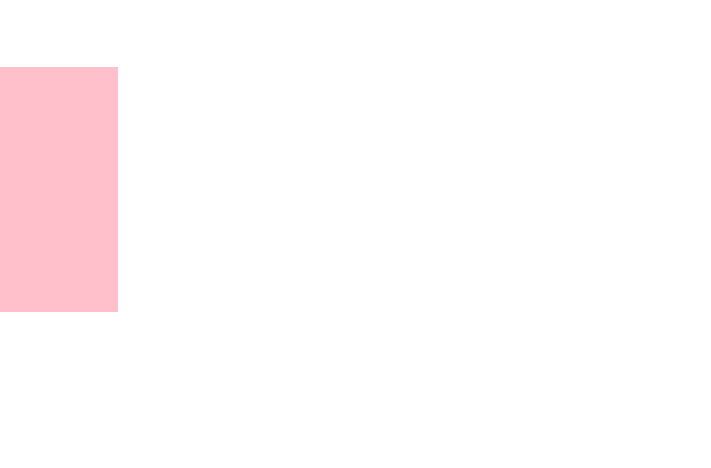

### 2.4 translateZ

translform:translateZ(100px)：仅仅是在 Z 轴上移动。有了透视，就能看到 translateZ 引起的变化了。

- translateZ：近大远小
- translateZ：往外是正值
- translateZ：往里是负值

```html
<!doctype html>
<html lang="en">

<head>
    <meta charset="UTF-8">
    <meta name="viewport" content="width=device-width, initial-scale=1.0">
    <meta http-equiv="X-UA-Compatible" content="ie=edge">
    <title>translateZ</title>
    <style>
        body {
            perspective: 500px;
        }

        div {
            width: 200px;
            height: 200px;
            background-color: pink;
            margin: 100px auto;
            transform: translateZ(0);
        }
    </style>
</head>

<body>
<div></div>
<div></div>
<div></div>
</body>

</html>
```

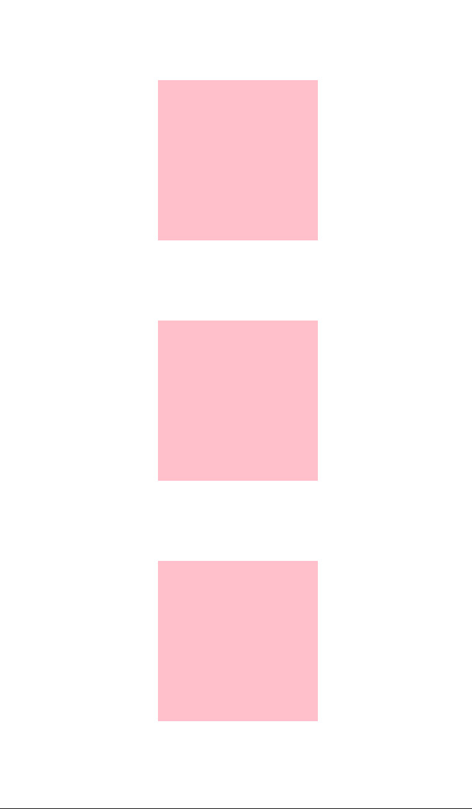

### 2.5 3D旋转 rotate3d

3D旋转指可以让元素在三维平面内沿着 x轴，y轴，z轴或者自定义轴进行旋转。

**语法**

- transform: rotateX(45deg)：沿着 x 轴正方向旋转 45 度
- transform: rotateY(45deg)：沿着 y 轴正方向旋转 45deg
- transform: rotateZ(45deg)：沿着 z 轴正方向旋转 45deg
- transform: rotate3d(x, y, z, deg)：沿着自定义轴旋转 deg 为角度（了解即可）


对于元素旋转的方向的判断，我们需要先学习一个左手准则。

**左手准则**

- 左手的手拇指指向 x 轴的正方向
- 其余手指的弯曲方向就是该元素沿着 x 轴旋转的方向

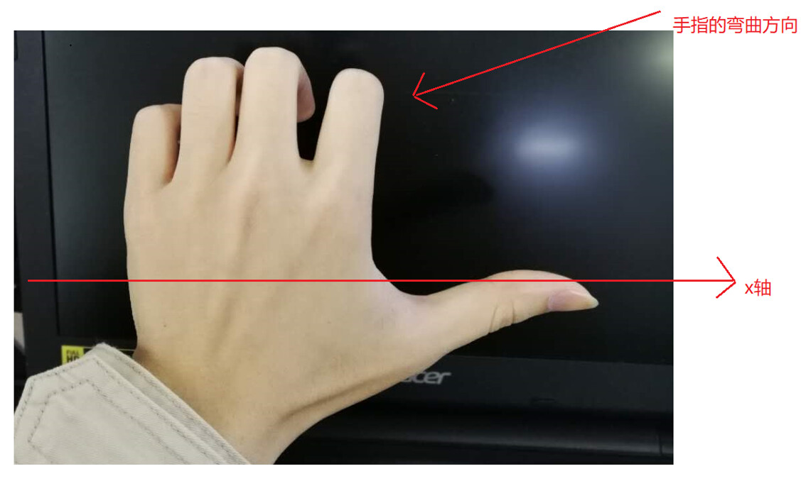

```html
<!doctype html>
<html lang="en">

<head>
    <meta charset="UTF-8">
    <meta name="viewport" content="width=device-width, initial-scale=1.0">
    <meta http-equiv="X-UA-Compatible" content="ie=edge">
    <title>rotateX</title>
    <style>
        body {
            /* 利用透视产生近大远小效果 */
            perspective: 300px;
        }

        img {
            display: block;
            margin: 100px auto;
            transition: all 1s;
        }

        img:hover {
            transform: rotateX(45deg);
        }
    </style>
</head>

<body>

</body>

</html>
```


---

- 左手的手拇指指向 y 轴的正方向
- 其余手指的弯曲方向就是该元素沿着 y 轴旋转的方向（正值）

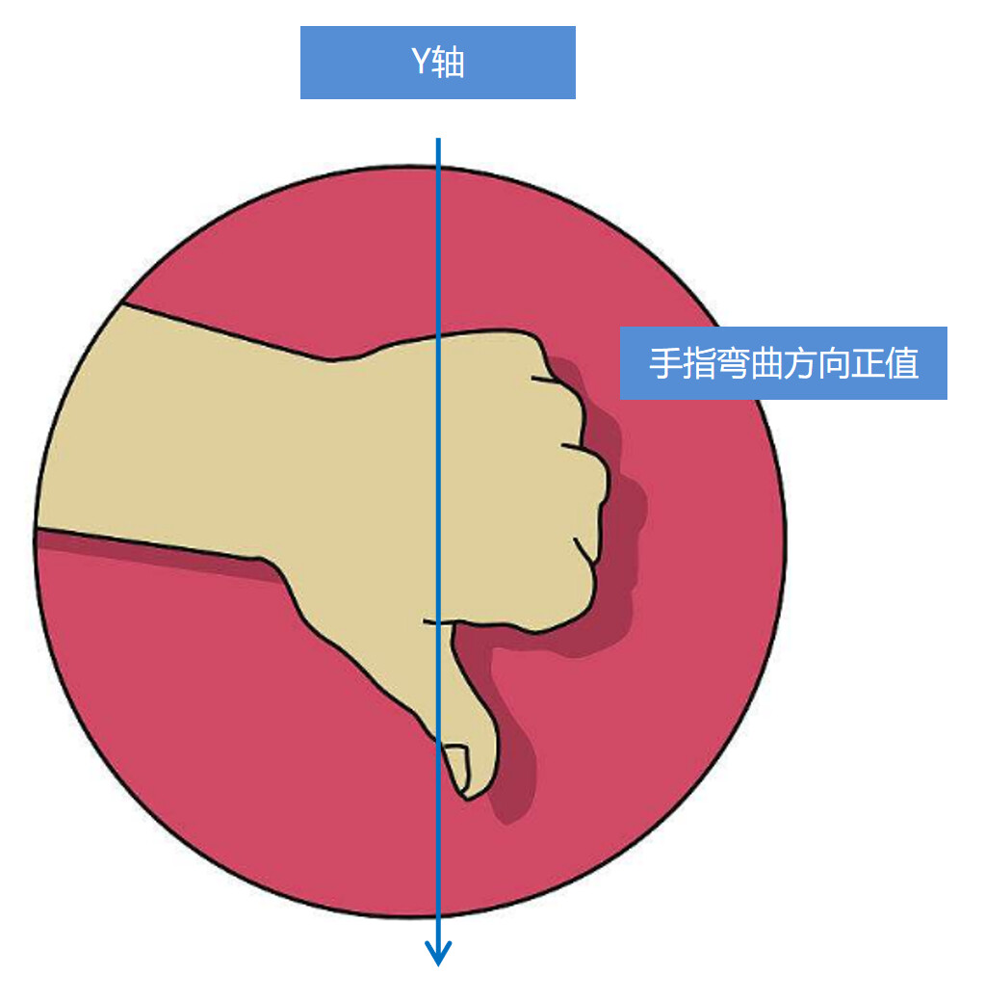

```html
<!doctype html>
<html lang="en">

<head>
    <meta charset="UTF-8">
    <meta name="viewport" content="width=device-width, initial-scale=1.0">
    <meta http-equiv="X-UA-Compatible" content="ie=edge">
    <title>rotateY</title>
    <style>
        body {
            perspective: 500px;
        }

        img {
            display: block;
            margin: 100px auto;
            transition: all 1s;
        }

        img:hover {
            transform: rotateY(45deg);
        }
    </style>
</head>

<body>

</body>
</html>
```

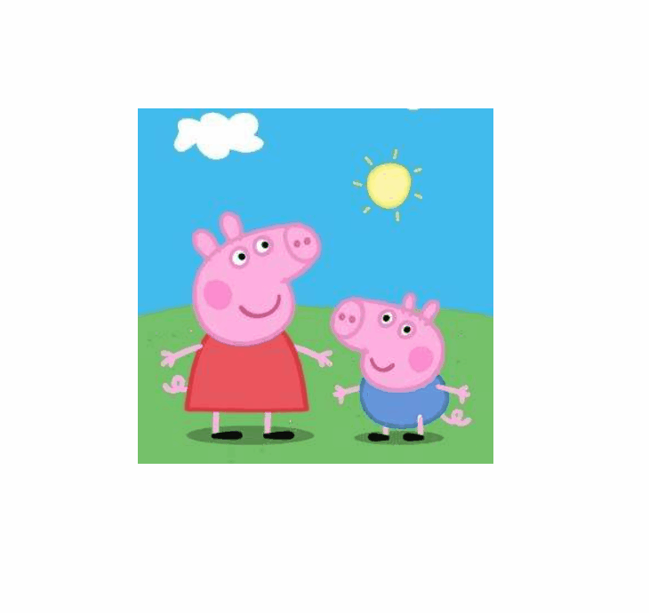

```html
<!doctype html>
<html lang="en">

<head>
    <meta charset="UTF-8">
    <meta name="viewport" content="width=device-width, initial-scale=1.0">
    <meta http-equiv="X-UA-Compatible" content="ie=edge">
    <title>rotateZ</title>
    <style>
        body {
            perspective: 500px;
        }

        img {
            display: block;
            margin: 100px auto;
            transition: all 1s;
        }

        img:hover {
            transform: rotateZ(180deg);
        }
    </style>
</head>

<body>

</body>

</html>
```


transform: rotate3d(x, y, z, deg)：沿着自定义轴旋转 deg 为角度（了解即可）。

xyz 是表示旋转轴的矢量，表示你是否希望沿着该轴旋转，最后一个表示旋转的角度。

- transform: rotate3d(1, 0, 0, 45deg)：就是沿着 x 轴旋转 45deg
- transform: rotate3d(0, 1, 0, 45deg)：就是沿着 y 轴旋转 45deg
- transform: rotate3d(0, 0, 1, 45deg)：就是沿着 z 轴旋转 45deg
- transform: rotate3d(1, 1, 0, 45deg)：就是沿着对角线（矢量计算）旋转 45deg

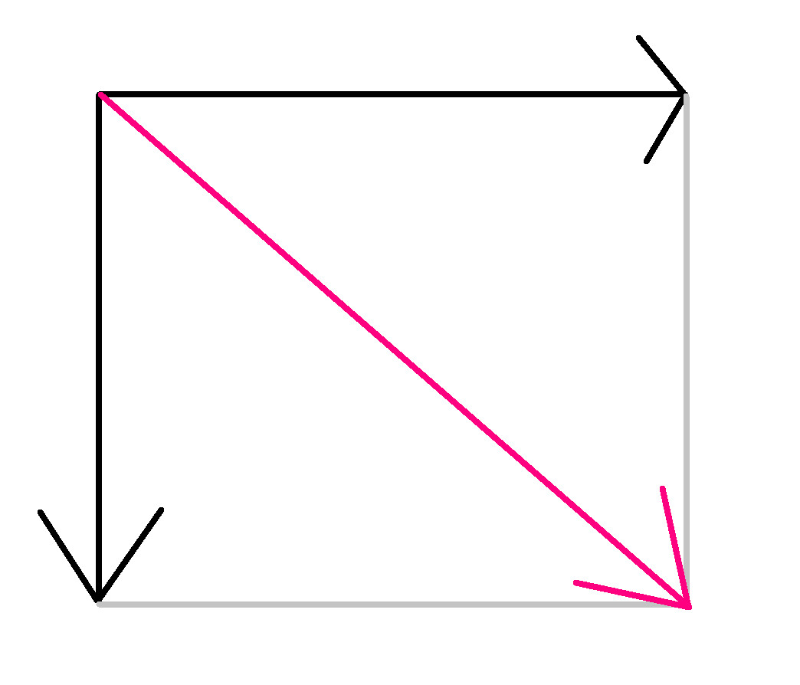

```html
<!doctype html>
<html lang="en">

<head>
    <meta charset="UTF-8">
    <meta name="viewport" content="width=device-width, initial-scale=1.0">
    <meta http-equiv="X-UA-Compatible" content="ie=edge">
    <title>rotate3d</title>
    <style>
        body {
            perspective: 500px;
        }

        img {
            display: block;
            margin: 100px auto;
            transition: all 1s;
        }

        img:hover {
            /* transform: rotate3d(x,y,z,deg); */
            /* transform: rotate3d(1, 0, 0, 45deg); */
            /* transform: rotate3d(0, 1, 0, 45deg); */
            transform: rotate3d(1, 1, 0, 45deg);
        }
    </style>
</head>

<body>

</body>

</html>
```


### 2.6 3D呈现 transfrom-style

- 控制子元素是否开启三维立体环境
- transform-style: flat 子元素不开启 3d 立体空间（默认的）
- transform-style: preserve-3d; 子元素开启立体空间
- 代码写给父级，但是影响的是子盒子
- 这个属性很重要，后面必用


```html
<!doctype html>
<html lang="en">

<head>
    <meta charset="UTF-8">
    <meta name="viewport" content="width=device-width, initial-scale=1.0">
    <meta http-equiv="X-UA-Compatible" content="ie=edge">
    <title>transform-style</title>
    <style>
        body {
            perspective: 500px;
        }

        .box {
            position: relative;
            width: 200px;
            height: 200px;
            margin: 100px auto;
            transition: all 2s;
            /* 让子元素保持3d立体空间环境 */
            transform-style: preserve-3d;
        }

        .box:hover {
            transform: rotateY(60deg);
        }

        .box div {
            position: absolute;
            top: 0;
            left: 0;
            width: 100%;
            height: 100%;
            background-color: pink;
        }

        .box div:last-child {
            background-color: purple;
            transform: rotateX(60deg);
        }
    </style>
</head>

<body>
<div class="box">
    <div></div>
    <div></div>
</div>
</body>

</html>
```

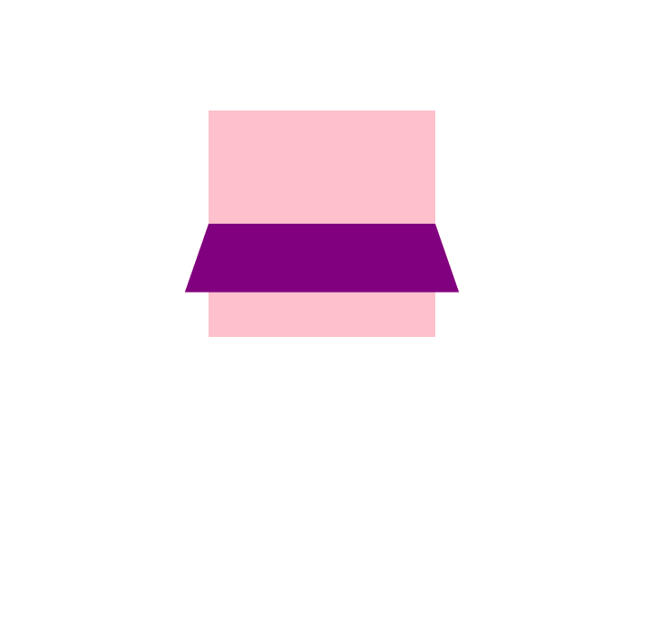

【案例：两面翻转的盒子】

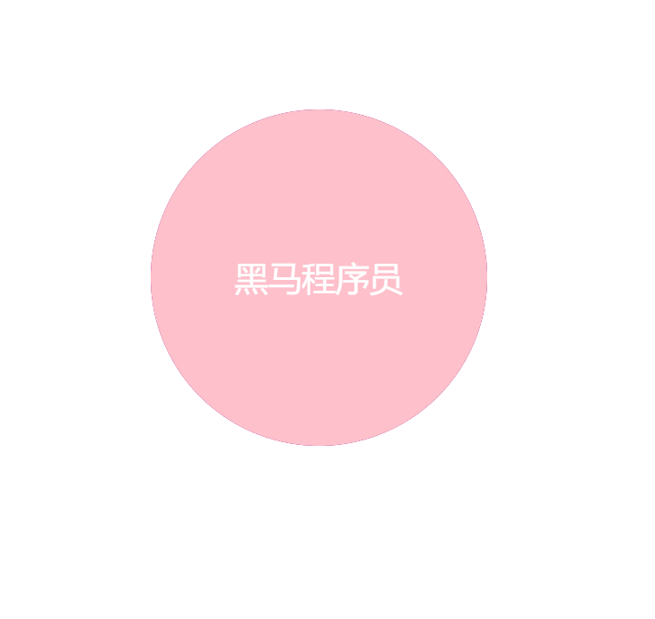

实现步骤：

1. 搭建 HTML 结构

```html
<div class="box">
	<div class="front">黑马程序员</div>
    <div class="back">pink老师等你</div>
</div>
```

- box 父盒子里面包含前后两个子盒子
- box 是翻转的盒子 front 是前面盒子 back 是后面盒子

2. CSS 样式

- box 指定大小，切记要添加 3d 呈现
- back 盒子要沿着 Y 轴翻转 180 度
- 最后鼠标经过 box 沿着 Y 旋转 180deg

代码：

```html
<!doctype html>
<html lang="en">

<head>
    <meta charset="UTF-8">
    <meta name="viewport" content="width=device-width, initial-scale=1.0">
    <meta http-equiv="X-UA-Compatible" content="ie=edge">
    <title>两面翻转的盒子</title>
    <style>
        body {
            perspective: 400px;
        }

        .box {
            position: relative;
            width: 300px;
            height: 300px;
            margin: 100px auto;
            transition: all .4s;
            /* 让背面的紫色盒子保留立体空间 给父级添加的 */
            transform-style: preserve-3d;
        }

        .box:hover {
            transform: rotateY(180deg);
        }

        .front,
        .back {
            position: absolute;
            top: 0;
            left: 0;
            width: 100%;
            height: 100%;
            border-radius: 50%;
            font-size: 30px;
            color: #fff;
            text-align: center;
            line-height: 300px;
        }

        .front {
            background-color: pink;
            z-index: 1;
        }

        .back {
            background-color: purple;
            /* 像手机一样 背靠背 旋转 */
            transform: rotateY(180deg);
        }
    </style>
</head>

<body>
<div class="box">
    <div class="front">黑马程序员</div>
    <div class="back">pink老师这里等你</div>
</div>
</body>

</html>
```

---

【案例：3D 导航栏】


实现步骤：

1. 搭建 HTML 结构

```html
<ul>
    <li>
        <div class="box">
            <div class="front">黑马程序员</div>
            <div class="bottom">pink老师等你</div>
         </div>
    </li>
</ul>
```

- li 做导航栏
- .box 是翻转的盒子 front 是前面盒子 bottom 是底下盒子

2. CSS 样式

- li 设置大小，加透视和 3d 呈现
- front 需要前移 17.5 像素
- bottom 需要下移 17.5 像素并且要沿着 x 轴翻转 负 90 度
- 鼠标放到 box 让盒子旋转 90 度

```html
<!doctype html>
<html lang="en">

<head>
    <meta charset="UTF-8">
    <meta name="viewport" content="width=device-width, initial-scale=1.0">
    <meta http-equiv="X-UA-Compatible" content="ie=edge">
    <title>3D导航栏案例</title>
    <style>
        * {
            margin: 0;
            padding: 0;
        }

        ul {
            margin: 100px;
        }

        ul li {
            float: left;
            margin: 0 5px;
            width: 120px;
            height: 35px;
            list-style: none;
            /* 一会我们需要给 box 旋转 也需要透视 干脆给 li 加 里面的子盒子都有透视效果 */
            perspective: 500px;
        }

        .box {
            position: relative;
            width: 100%;
            height: 100%;
            transform-style: preserve-3d;
            transition: all .4s;
        }

        .box:hover {
            transform: rotateX(90deg);
        }

        .front,
        .bottom {
            position: absolute;
            left: 0;
            top: 0;
            width: 100%;
            height: 100%;
        }

        .front {
            background-color: pink;
            z-index: 1;
            transform: translateZ(17.5px);
        }

        .bottom {
            background-color: purple;
            /* 这个x轴一定是负值 */
            /* 我们如果有移动 或者其他样式，必须先写我们的移动 */
            transform: translateY(17.5px) rotateX(-90deg);
        }
    </style>
</head>

<body>
<ul>
    <li>
        <div class="box">
            <div class="front">黑马程序员</div>
            <div class="bottom">pink老师等你</div>
        </div>
    </li>
    <li>
        <div class="box">
            <div class="front">黑马程序员</div>
            <div class="bottom">pink老师等你</div>
        </div>
    </li>
    <li>
        <div class="box">
            <div class="front">黑马程序员</div>
            <div class="bottom">pink老师等你</div>
        </div>
    </li>
    <li>
        <div class="box">
            <div class="front">黑马程序员</div>
            <div class="bottom">pink老师等你</div>
        </div>
    </li>
    <li>
        <div class="box">
            <div class="front">黑马程序员</div>
            <div class="bottom">pink老师等你</div>
        </div>
    </li>
    <li>
        <div class="box">
            <div class="front">黑马程序员</div>
            <div class="bottom">pink老师等你</div>
        </div>
    </li>
</ul>
</body>

</html>
```

---

【综合案例：旋转木马】


1. 搭建 HTML 结构

```html
<section>
    <div></div>
    <div></div>
    <div></div>
    <div></div>
    <div></div>
    <div></div>
</section>
```

- 里面的 6 个 div 分别是 6 个狗狗图片
- 注意最终旋转是 section 标签旋转

2. CSS 样式

- 给 body 添加 透视效果 perspective: 1000px;
- 给 section 添加大小，一定不要忘记添加 3d 呈现效果控制里面的 6 个 div
  -  别忘记子绝父相，section 要加相对定位
- 里面 6 个 div 全部绝对定位叠到一起，然后移动不同角度旋转和距离
  - 注意：旋转角度用 rotateY 距离肯定用 translateZ 来控制
- 给 section 添加动画 animation，让它可以自动旋转即可

```html
<!doctype html>
<html lang="en">

<head>
    <meta charset="UTF-8">
    <meta name="viewport" content="width=device-width, initial-scale=1.0">
    <meta http-equiv="X-UA-Compatible" content="ie=edge">
    <title>综合案例：旋转木马</title>
    <style>
        body {
            perspective: 1000px;
        }

        section {
            position: relative;
            width: 300px;
            height: 200px;
            margin: 150px auto;
            transform-style: preserve-3d;
            /* 添加动画效果 */
            animation: rotate 10s linear infinite;
            background: url(media/pig.jpg) no-repeat;
        }

        section:hover {
            /* 鼠标放入 section 停止动画 */
            animation-play-state: paused;
        }

        @keyframes rotate {
            0% {
                transform: rotateY(0);
            }
            100% {
                transform: rotateY(360deg);
            }
        }

        section div {
            position: absolute;
            top: 0;
            left: 0;
            width: 100%;
            height: 100%;
            background: url(media/dog.jpg) no-repeat;
        }

        section div:nth-child(1) {
            transform: rotateY(0) translateZ(300px);
        }

        section div:nth-child(2) {
            /* 先旋转好了再 移动距离 */
            transform: rotateY(60deg) translateZ(300px);
        }

        section div:nth-child(3) {
            /* 先旋转好了再 移动距离 */
            transform: rotateY(120deg) translateZ(300px);
        }

        section div:nth-child(4) {
            /* 先旋转好了再 移动距离 */
            transform: rotateY(180deg) translateZ(300px);
        }

        section div:nth-child(5) {
            /* 先旋转好了再 移动距离 */
            transform: rotateY(240deg) translateZ(300px);
        }

        section div:nth-child(6) {
            /* 先旋转好了再 移动距离 */
            transform: rotateY(300deg) translateZ(300px);
        }
    </style>
</head>

<body>
<section>
    <div></div>
    <div></div>
    <div></div>
    <div></div>
    <div></div>
    <div></div>
</section>
</body>

</html>
```

## 3.浏览器私有前缀

浏览器私有前缀是为了**兼容老版本**的写法，**比较新版本的浏览器无须添加**。

### 3.1 私有前缀

- -moz-：代表 firefox 浏览器私有属性
- -ms-：代表 ie 浏览器私有属性
- -webkit-：代表 safari、chrome 私有属性
- -o-：代表 Opera 私有属性

### 3.2 提倡的写法

```css
-moz-border-radius: 10px; 
-webkit-border-radius: 10px; 
-o-border-radius: 10px; 
border-radius: 10px;
```

> 以后通过构建工具来自动加这些属性