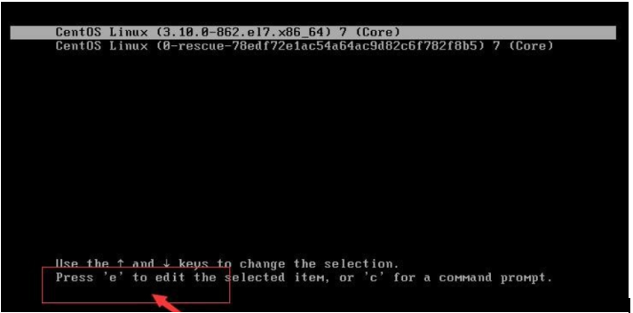
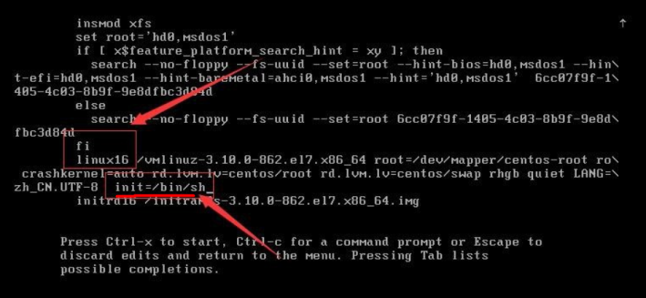

# Linux 实用指令

## 指令运行级别

### 基本介绍

+ 运行级别说明:

0:          关机:red_circle:

1:          单用户[找回丢失密码]

2:          多用户状态没有网络服务

3           **多用户状态有网络服务**

4:          系统未使用保留给客户

5:          图形界面:

6:          系统重启

常用运行级别分别是3和5，也可以指定默认运行级别

### 应用实例

命令: init [0123456]

应用案例:通过init 来切换不同的运行级别，比如动 5-3，然后关机。

### CentOS7后运行级别说明

在centos7以前，/etc/initab文件中进行了简化，如下:

**multi-user. target**: analogous to runlevel 3

**graphical.target**: analogous to runlevel 5

+ To view current default target, run:

**systemctl get-default**

+ To set a default target, run:

**systemcfl set-default TARGET.target**

## 找回root密码

1. 首先，启动系统，进入开机界面，在界面中按“e”进入编辑界面。如图

2. 进入编辑界面，使用键盘上的上下键把光标往下移动，找以““Linux16”开头内容所在的行数”，在行的最后面输入：init=/bin/sh。如图

3. 接着，输入完成后，直接按快捷键：Ctrl+x 进入**单用户模式**
4. 接着，在光标闪烁的位置中输入：mount -o remount,rw /（注意：各个单词间有空格），完成后按键盘的回车键（Enter）。
5. 在新的一行最后面输入：passwd， 完成后按键盘的回车键（Enter）。输入密码，**然后再次确认密码即**可(**提示: 密码长度最好8位以上,但不是必须的**), 密码修改成功后，会显示passwd.....的样式，说明密码修改成功

6. 接着，在鼠标闪烁的位置中（最后一行中）输入：touch /.autorelabel（注意：touch与 /后面有一个空格），完成后按键盘的回车键（Enter）
7. 继续在光标闪烁的位置中，输入：exec /sbin/init（注意：exec与 /后面有一个空格），完成后按键盘的回车键（Enter）,等待系统自动修改密码(**提示：这个过程时间可能有点长，耐心等待**)，完成后，系统会自动重启, **新的密码生效**了

## 帮助指令

### man 获得帮助信息

+ 基本语法: man命令或配置文件(功能描述:获得帮助信息)
  
  案例:查看ls命令的帮助信息 man ls
  在linux 下，隐藏文件是以.开头﹐选项可以组合使用比如 ls -al,比如 ls-al /root

### help 指令

+ 基本语法: help命令(功能描述:获得shell内置命令的帮助信息)

## 文件目录类

### pwd 指令

+ 基本语法: pwd(功能描述:显示当前工作目录的绝对路径)

### ls 指令

+ 基本语法:ls(选项)[目录或是文件]

+ 常用选项

  -a :显示当前目录所有的文件和目录，包括隐藏的。
  -l   :以列表的方式显示信息

### cd 指令

+ 基本语法:

cd(参数)(功能描述:切换到指定目录)

cd ~或者cd:回到自己的家目录，比如你是root,cd ~到/root

cd .. 回到当前目录的上一级目录

+ 应用案例:

> 案例1:使用绝对路径切换到root目录，
>
> cd /root
>
> 案例2:使用相对路径到root目录，比如在/home/tom ,
>
> cd ../../root

### mkdir 指令

+ mkdir指令用于创建目录

基本语法：mkdir [选项] 要创建的目录

+ 常用选项

-p:创建多级目录

+ 应用案例

> 案例1：创建一个目录/home/dog
>
> mkdir /home/dog
>
> 案例2:   创建多级目录 /home/animal/tiger
>
> mkdir -p /home/animal/tiger

### rmdir 指令删除空目录

基本语法: rmdir [选项] 要删除的空目录

+ 应用实例

> 案例：删除一个目录 /home/dog
>
> rmdir /home/dog

+ 使用细节:

1. **rmdir删除的是空目录，如果目录下有内容时无法删除的。**
2. 提示:**如果需要删除非空目录，需要使用rm -rf要删除的目录**
3. 比如:rm -rf /home/animal

### touch 指令

+ touch 指令创建空文件

基本语法: touch 文件名称

### cp 指令

+ cp 指令拷贝文件到指定目录

基本语法:  cp[选项] source dest

+ 常用选项

-r:递归复制整个文件

+ 应用案例:

> 案例1:将/home/hello.txt拷贝到/home/bbb目录下
>
> cp hello.txt   /home/bbb
>
> 案例2:递归复制整个文件夹，举例，比如将/home/bbb整个目录，拷贝到 /opt
>
> cp -r /home/bbb/opt

+ 使用细节

**强制覆盖不提示的方法：\cp ,\cp -r /home/bbb/opt**

### rm 指令

说明：rm 指令移除文件或目录

基本语法: rm [选项] 要删除的文件或目录

+ 常用选项

-r :递归删除整个文件夹

-f: 强制删除不提示

+ 应用案例

> 案例1：将/home/hello.txt删除，      rm /home/hello.txt
>
> 案例2: 递归删除整个文件夹 /home/bbb,      rm -rf /home/bbb[删除整个文件夹，不提示] 

+ 使用细节:
**强制删除不提示的方法，带上 -f 参数即可**

### mv 指令

说明: mv 移动文件与目录或重命名

基本语法: mv oldNameFile newNameFile (功能描述:重命名)

mv /temp/movefile/targetFolder             (功能描述:移动文件)

+ 应用实例:

> 案例1:将/home/cat.txt文件重新命名为pig.txt           
>
> mv  /home/cat.txt   pig.txt
>
> 案例2:将/home/pig.txt文件移动到/root目录下           
>
> mv    /home/pig.txt       /root
>
> 案例3:移动整个目录，比如将/opt/bbb移动到/home 下   
>
> mv    /opt/bbb      /home/

### cat 指令

说明:cat 查看文件内容

基本语法:cat [选项] 要查看的文件

+ 常用选项:

-n: 显示行号

+ 应用案例

> 案例: /etc/profile 文件内容，并显示行号
>
> cat -n /etc/profile

+ 使用细节

1. **cat只能浏览文件，而不能修改文件，为了浏览方便，一般会带上管道命令|more**
2. **cat -n/etc/profile | more「进行交互]**

### more 指令

more指令是一个基于VI编辑器的文本过滤器，它以全屏幕的方式按页显示文本文件的内容。more指令中内置了若干快捷键(交互的指令)。

基本语法:more 要查看的文件

+ 操作说明，如图：

| 操作          | 功能说明                              |
| ------------- | ------------------------------------- |
| 空白键(space) | 代表向下翻一页                        |
| Enter         | 代表向下翻一行                        |
| q             | 代表立刻离开more,不再显示该文件内容。 |
| Ctrl+F        | 向下滚动一屏                          |
| Ctrl+B        | 返回上一屏                            |
| =             | 输出当前行的行号                      |
| :f            | 输出文件名和当前行的行号              |

### less 指令

less 指令用来分屏查看文件内容，它的功能与more 指令类似，但是比 more 指令更加强大，支持各种显示终端。less指令在显示文件内容时，并不是一次将整个文件加载之后才显示，而是根据显示需要加载内容，对于显示大型文件具有较高的效率。

基本语法：less 要查看的文件

+ 操作说明，如图:

| 操作       | 功能说明                                      |
| ---------- | --------------------------------------------- |
| 空白键     | 向下翻动一页                                  |
| [pagedown] | 向下翻动一页                                  |
| [pageup]   | 向下翻动一页                                  |
| /子串      | 向下搜寻[字串]的功能;n:向下查找；N:向上查找； |
| ?字符      | 向上搜寻[字串]的功能;n:向上查找；N:向下查找;  |
| q          | 离开less这个程序;                             |

### echo 指令

说明: echo暑促胡内容到控制台

基本语法:echo [选项] [输出内容]
+ 应用案例:

> 案例：使用echo指令输 出环境变量，比如输出 $PATH$HOSTNAME,
>
> echo $HOSTNAME
>
> 案例:使用echo指令输出hello.world!
>
> echo hello.world!

### head 指令

说明:head用于显示文件的开头部分内容，默认情况下head指令显示文件的前10行内容

基本语法: head 文件(功能描述:查看文件头10行内容)

head -n 5 文件         (功能描述:查看文件头5行内容，5行可以是任意行数)

+ 应用实例:

> 查看/etc/profile 的前面5行代码
>
> head -n 5 /etc/profile

### tail 指令

说明:tail用于输出文件中尾部的内容，默认情况下tail指令显示文件的后10行内容

基本语法:tail 文件 (功能描述:查看文件尾10行内容)

tail -n 5     (功能描述:查看文件尾5行内容，5可以是任意行数)

tail -f  文件 (功能描述:实时追踪该文档的所有更新)

### >指令和>>指令

说明:>输出重定向和>>追加

基本语法::ls -l >文件(功能描述:列表的内容写入文件a.txt(覆盖写))

ls -al >> 文件        (功能描述:列表的内容追加到文件a.txt的末尾)

cat 文件1 > 文件2 (功能描述:将文件1的内容覆盖到文件2)

echo "内容" >> 文件(追加)

### ln 指令

说明:软链接也称为符号链接，类似于windows里的快捷方式，主要存放了链接其他文件的路径

基本语法::ln -s [原文件或目录] [软连接名] (功能描述:给原文件创建一个软连接)

+ 应用实例:

> 案例1:在/home目录下创建一个软连接myroot,连接到/root目录
>
> ln -s /root /home/myroot
>
> 案例2:删除软连接 myroot
>
> rm /home/myroot

+ 细节说明

**当我们使用pwd指令查看目录时，仍然看到的是软连接所在的目录**

### history 指令

说明:查看已经执行过历史命令，也可以执行历史命令

基本语法::history  (功能描述:查看已经执行过历史命令)

+ 应用实例:

> 案例1:显示所有的历史命令
>
> history
>
> 案例2:显示最近使用过的10个指令
>
> history 10
>
> 案例3:执行历史编号为5的指令
>
> !5

## 时间日期类

### date指令-显示当前日期

+ 基本语法

date                                                         (功能描述:显示当前时间)

date +%Y (功能描述:显示当前年份)

date +%m                                               (功能描述:显示当前月份)

date +%d  (功能描述:显示当前是哪一天)

date "+%Y-%m-%d %H:%M:%S"(功能描述:显示年月日时分秒)

### date指令-设置日期

基本语法:date -s 字符串时间

+ 应用案例:

> 案例1:设置系统当前时间,比如设置成2020-11-03 20:02:10
>
> date -s "2020-11-03 20:02:10"

### cal指令

说明:查看日历指令 cal

基本语法: cal[选项]   (功能描述:不加选项，显示本月日历)

+ 应用实例:

> 案例1:显示当前日历 cal
>
> 案例2:显示2020年日历:cal 2020

## 搜索查找类

### find 指令

说明:find指令将从指定目录向下递归地遍历其各个子目录，将满足条件的文件或者目录显示在终端。

基本语法: find [搜索范围] [选项]

+ 选项说明:

| 选项            | 功能                             |
| --------------- | -------------------------------- |
| -name<查询方式> | 按照指定的文件名查找模式查找文件 |
| -user<用户名>   | 查找属于指定用户名所有文件       |
| -size<文件大小> | 按照指定的文件大小查找文件       |

+  应用案例:

> 案例1:按文件名:根据名称查找/home目录下的hello.txt文件
>
> find /home -name hello.txt
>
> 案例2:按拥有者:查找/opt目录下，用户名称为nobody 的文件
>
> find /opt -user nobody
>
> 案例3:查找整个linux系统下大于200M的文件(+n大于 -n小于n等于，单位有k,M,G)
>
> find / -size +200M

### locate 指令

locate 指令可以快速定位文件路径。locate指令利用事先建立的系统中所有文件名称及路径的locate数据库实现快速定位给定的文件。Locate 指令无需遍历整个文件系统，查询速度较快。为了保证查询结果的准确度，管理员必须定期更新locate时刻
基本语法:locate 搜索文件

+ 特别说明：**由于locate 指令基于数据库进行查询，所以第一次运行前，必须使用updatedb指令创建locate数据库。**

+ **which指令，可以查看某个指令在哪个目录下，比如 ls指令在哪个目录 which ls**

### grep指令和管道符号|

说明:grep过滤查找，管道符，“|”，表示将前一个命令的处理结果输出传递给后面的命令处理。

基本语法:grep [选项] 查找内容 源文件

+ 常用选项:

| 选项 | 功能             |
| ---- | ---------------- |
| -n   | 显示匹配行及行号 |
| -i   | 忽略字母大小写   |

+ 应用实例:

>案例:请在hello.txt文件中，查找"yes"所在行，并且显示行号
写法1: cat/home/hello.txt | grep "yes"
写法2: grep -n "yes" /home/hello.txt

## 压缩和解压类

### gzip/gunzip 指令

说明:gzip 用于压缩文件，gunzip用于解压的

+ 基本语法:

gzip 文件             (功能描述:压缩文件，只能将文件压缩为*.gz文件)

gunzip 文件.gz    (功能描述:解压缩文件命令)

+ 应用案例:

> 案例1: gzip压缩，将/home下的 hello.txt文件进行压缩
>
> gzip  /home/hello.txt
>
> 案例2 : gunzip压缩，将/home下的 hello.txt.gz文件进行解压缩
>
> gunzip /home/hello.txt.gz

### zip/unzip指令

说明:zip 用于压缩文件，unzip用于解压的，这个在项目打包发布中很有用的

+ 基本语法:

zip  [选项] XXX.zip将要压缩的内容      （功能描述:压缩文件和目录的命令)
unzip [选项] XXX.zip                         (功能描述:解压缩文件)

+ zip常用选项

**-r:递归压缩，即压缩目录**

+ unzip的常用选项

**-d<目录>:指定解压后文件的存放目录**

+ 应用案例:

> 案例1:将/home下的所有文件/文件夹进行压缩成myhome.zip
>
> zip -r myhome.zip /homel[将home目录及其包含的文件和子文件夹都压缩]
>
> 案例2:将myhome.zip解压到lopt/tmp_目录下
>
> mkdir /opt/tmp
>
> unzip-d /opt/tmp /home/myhome.zip

### tar指令

tar指令是打包指令，最后打包后的文件是.tar.gz的文件。

基本语法:tar [选项] XXX.tar.gz打包的内容―(功能描述:打包目录，压缩后的文件格式.tar.gz)

+ 选项说明:

| 选项 | 功能               |
| ---- | ------------------ |
| -c   | 产生.tar打包文件   |
| -v   | 显示详细信息       |
| -f   | 指定压缩后的文件名 |
| -z   | 打包同时压缩       |
| -x   | 解包.tar文件       |

+ 应用实例:

> 案例1:压缩多个文件，将/home/pig.txt和/home/cat,txt压缩成pc.tar.gz
>
> tar  -zcvf   pc.tar.gz   /home/pig.txt   /home/cat.txt
>
> 案例2:将/home 的文件夹压缩成myhome.tar.gz
>
> tar  -zcvf   myhome.tar.gz   /home/
>
> 案例3:将pc.tar.gz解压到当前目录
>
> tar  -zxvf   pc.tar.gz
>
> 案例4:将myhome.tar.gz解压到/opt/tmp2目录下
>
> (1) mkdir   /opt/tmp2
>
> (2) tar    -zxvf    /home/myhome.tar.gz   -C  /opt/tmp2

