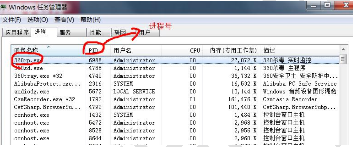
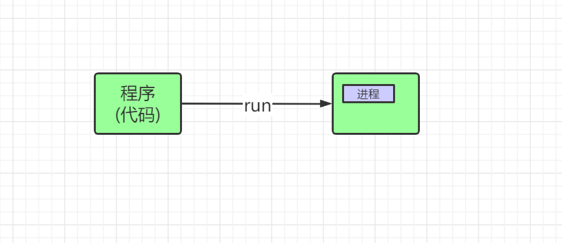
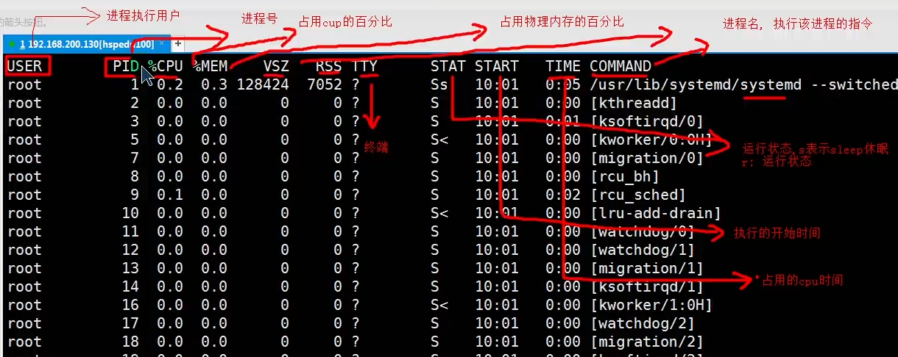
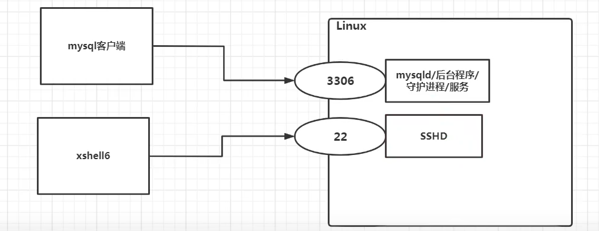
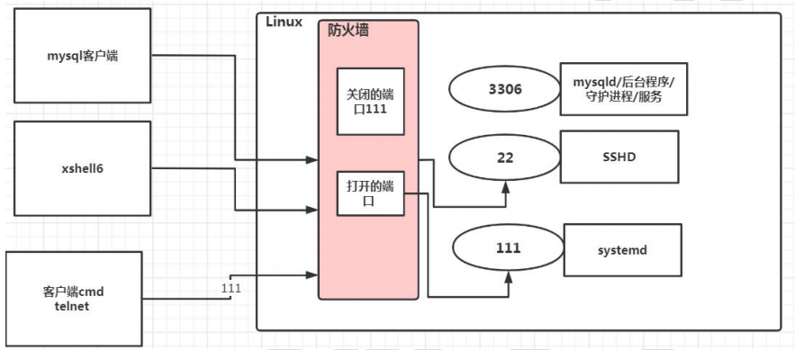
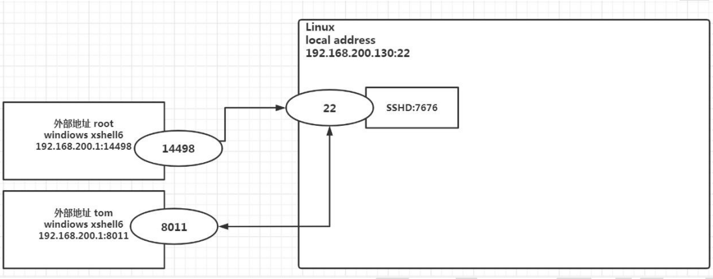

# Linux 进程管理

## 基本介绍

1. 在LINUX中，每个**执行的程序**都称为一个**进程**。每一个进程都分配一个ID号(**pid,进程号**)。
2. 每个进程都可能以两种方式存在的。**前台**与**后台**，所谓前台进程就是用户目前的屏幕上可以进行操作的。后台进程则是实际在操作，但由于屏幕上无法看到的进程，通常使用后台方式执行。
3. 一般系统的服务都是以后台进程的方式存在，而且都会常驻在系统中。直到关机才才结束。
4. 示意图

## 显示系统执行的进程

### 基本介绍

ps命令是用来查看目前系统中，有哪些正在执行，以及它们执行的情况，可以不加参数。

+ ps显示的信息选项:

| 字段 | 说明                   |
| ---- | ---------------------- |
| PID  | 进程识别号             |
| TTY  | 终端机号               |
| TIME | 此进程所消CPU时间      |
| CMD  | 正在执行的命令或进程名 |

+ ps -a:显示当前终端的所有进程信息
+ ps -u:以用户的格式显示进程信息
+ ps -x:显示后台进程进行的参数

### ps详解

+ 指令: ps  -aux l grep xxx ，比如我看看有没有sshd服务

  **ps -aux | grep sshd**

+ 指令说明

  **System V**展示风格

  **USER**:用户名称

  **PID**:进程号

  **%CPU**:进程占用CPU的百分比

  **%MEM**:进程占用物理内存的百分比

  **VSZ**:进程占用的虚拟内存大小(单位:KB)

  **RSS**:进程占用的物理内存大小(单位:KB)

  **TT**:终端名称,缩写

  **STAT**:进程状态，其中**S-**睡眠，**s-**表示该进程是会话的先导进程，**N-**表示进程拥有比普通优先

  级更低的优先级，**R-**正在运行，**D-**短期等待，**Z-**僵死进程，**T-**被跟踪或者被停止等等

  **STARTED**:进程的启动时间

  **TIME**:CPU时间，即进程使用CPU的总时间

  **COMMAND**:启动进程所用的命令和参数，如果过长会被截断显示

### 应用案例

要求:以全格式显示当前所有的进程，查看进程的父进程。查看 sshd 的父进程信息

ps -ef 是以全局格式显示当前所有进程

-e 显示所以进程     -f   全格式

ps -ef | grep sshd

+ BSD风格

**UID：用户 ID**

**PID:   进程 ID**

**PPID:  父进程ID**

**C**:CPU用于计算执行优先级的因子。数值越大，表明进程是CPU密集型运算，执行优先级会降低;数值越小,表明进程是I/O密集型运算，执行优先级会提高

**STIME**：进程启动的时间

**TTY**：完整的终端名称

**TIME** : CPU时间

**CMD** : 启动线程所用的命令和参数

## 终止进程kill和killall

### 介绍

若是某个进程执行一半需要停止时，或是已消了很大的系统资源时，此时可以考虑停止该进程。使用kill命令来完成此项任务。

### 基本语法

kill   [选项]   进程号(功能描述:通过进程号杀死/终止进程)

killall  进程名称〈功能描述:通过进程名称杀死进程，也支持通配符，这在系统因负载过大而变得很慢时很有用)

### 常用选项

-9:表示强迫进程立即停止

### 最佳实践

> 案例1:踢掉某个非法登录用户    **kill 进程号**
>
> (1) ps -aux | grep sshd
>
> (2) kill 9976
>
> 案例2:终止远程登录服务sshd,在适当时候再次重启sshd服务     **kill sshd 对应的进程号**
>
> 终止: kill 8137 (/user/sbin/sshd -D)
>
> 重启:  **/bin/systemctl   start  sshd.service**
>
> 案例3: 终止多个gedit,演示 **killall gedit**
>
> 案例4: 强制杀掉一个终端,指令kill -9 bash 对应的进程号
>
> (1) ps -aux | grep bash
>
> 比如 杀死 其他的终端 kill -9 9880 (强制杀死)

## 查看进程树

### 基本语法

pstree  [选项],可以更加直观的来看进程信息

### 常用选项

-p :显示进程的PID

-u: 显示进程的所属用户

### 应用实例

> 案例1: 请你树状的显示进程的pid
>
> pstree -p
>
> 案例2: 请你树状的形式显示进程的用户
>
> pstree -u

## 服务(service)管理

### 介绍

服务(service)本质就是进程,但是是运行在后台的,通常都会监听某个端口,等待其它程序的请求,比如(mysqld , sshd防火墙等)，因此我们又称为守护进程，是Linux中非常重要的知识点。【原理图】

### service 管理指令

1. service 服务名 [start|stop|restart|reload|status]
2. 在CentOS7.0后，很多服务不再使用service,而是systemctl
3. service指令管理的服务在 /etc/init.d 查看

### service 管理指令案例

> 请使用service指令，查看，关闭，启动network [注意:在虚拟系统演示，因为网络连接会关
>
> 闭]指令:
>
> service network status
>
> service network stop
>
> service network start

### 查看服务名

方式1:使用setup     -> 系统服务就可以看到全部.

方式2:/etc/init.d 看到 service 指令管理的服务

ls -l /etc/init.d

### 服务的运行级别(runlevel)

+ Linux有7种运行级别:常用的是**3和5**

运行级别0:系统停机状态，系统默认运行级别不能设为0，否则不能正常启动

运行级别1:单用户工作状态，root权限，用于系统维护，禁止远程登陆

运行级别2:多用户状态(没有NFS)，不支持网络

运行级别**3**:完全的多用户状态(有NFS)，无界面，登陆后进入控制台命令行模式

运行级别4:系统未使用，保留

运行级别**5**:X11控制台，登陆后进入图形GUI模式

运行级别6:系统正常关闭并重启，默认运行级别不能设为6，否则不能正常启动

+ 开机的流程说明:

### CentOS7后运行级别说明

> 前面学过一次，再巩固一下

在 /etc/initab 进行了简化，如下：

**multi-user.target**: analogous to runlevel 3

**graphical.target**: analogous to runlevel 5

+ To view current default target, run:

systemctl get-default

+ To set a default target, run:

systemctl set-default TARGET.target

### chkconfig 指令

+ 基本介绍：

1. 通过chkconfig命令可以给服务的各个运行级别设置自启动/关闭
2. chkconfig指令管理的服务在/etc/init.d查看
3. 注意: Centos7.0后，很多服务使用systemctl 管理

+ chkconfig 基本语法

1. 查看服务        chkconfig     --list[grep xxx]
2. chkconfig      服务名           --list
3. chkconfig      --level      5     服务名    on/off

> 案例演示:对network服务进行各种操作，把 network在3运行级别,关闭自启动
>
> chkconfig --level 3 network off
>
> chkconfig --level 3 network on

+ 使用细节

**chkconfig 重新设置服务后自启动或关闭，需要重启机器reboot生效**.

### systemctl 管理指令

+ 基本语法:

systemctl   [start|stop|restart|status]  服务名

systemctl 指令管理的服务在 /usr/lib/systemd/system 查看

> ls -l /usr/lib/systemd/system

### systemctl 设置服务的自启动状态

systemctl list-unit-files [ | grep 服务名] (查看服务开机启动状态, grep可以进行过滤)

systemctl  enable   服务名  (设置服务开机启动)

systemctl  disable  服务名  (关闭服务开机启动)

systemctl  is-enabled    服务名(查询某个服务是否是自启动的)

### 应用案例

> 查看当前防火墙的状况，关闭防火墙和重启防火墙。
>
> systemctl status firewalld
>
> systemctl stop firewalld
>
> systemctl start firewalld

### 细节讨论

1. **关闭或者启用防火墙后，立即生效**。
2. **这种方式只是临时生效，当重启系统后，还是回归以前对服务的设置**。
3. **如果希望设置某个服务自启动或关闭永久生效，要使用systemctl     [enable|disable]   服务名**.

### 打开或者关闭指定端口

在真正的生产环境，往往需要将防火墙打开，但问题来了，如果我们把防火墙打开，那么外部请求数据包就不能跟服务器监听端口通讯。这时，需要打开指定的端口。

### firewall 指令

1. 打开端口:firewall-cmd --permanent --add-port=端口号/协议(查看协议指令 :netstat -anp | more)
2. 关闭端口:firewall-cmd --permanent --remove-port=端口号/协议号
3. 打开或关闭重新载入，才能生效:firewall-cmd --reload
4. 查询端口是否开发:firewall-cmd --query-port=端口/协议

### 应用案例

> 启用防火墙，测试111端口是否能telnet
>
> 开放111 端口 
>
> (1) firewall-cmd --permanent --add-port=111/tcp
>
> (2)需要firewall-cmd --reload
>
> 关闭111端口
>
> (1) firewall-cmd --permanent --remove-port=111/tcp
>
> (2)需要firewall-cmd --reload

## 动态监控进程

### 基本介绍

top与ps命令很相似。它们都用来显示正在执行的进程。Top与ps最大的不同之处，在于top在执行一段时间可以更新正在运行的的进程。

### 基本语法

top [选项]

### 选项说明

| 选项    | 功能                                       |
| ------- | ------------------------------------------ |
| -d 秒数 | 指定top命令每隔几秒更新。默认是3秒         |
| -i      | 使top不显示任何闲置或者僵死进程            |
| -p      | 通过指定监控进程ID来仅仅监控某个进程的状态 |

### 交互操作说明

| 操作 | 功能                          |
| ---- | ----------------------------- |
| 操作 | 功能                          |
| P    | 以CPU使用率排序，默认就是此项 |
| M    | 以内存的使用率排序            |
| N    | 以PID排序                     |
| q    | 退出top                       |

### 应用实例

> 案例1.监视特定用户，比如我们监控tom用户
>
> top:输入此命令，按回车键，查看执行的进程。
>
> u:然后输入"“u”回车，再输入用户名，即可.
>
> 案例2:终止指定的进程，比如我们要结束tom登录
>
> top:输入此命令，按回车键，查看执行的进程。
>
> k:然后输入“k”回车，再输入要结束的进程ID号
>
> 案例3:指定系统状态更新的时间(每隔10秒自动更新),默认是3秒
>
> top -d 10

## 监控网络状态

### 查看系统网络情况

+ 基本语法 

  netstat [选项]

+ 选项说明

  -an 按一定顺序排列输出

  -p   显示哪个进程在调用

+ 应用案例

  > 请查看服务名为sshd的服务信息
  >
  > netstat -anp | gerp sshd

### 检测主机连接命令

基本介绍:是一种网络检测工具，它主要是用检测远程主机是否正常，或是两部主机间的网线或网卡故障。

基本语法: ping 对方ip地址

> 如: ping www.baidu.com

:black_joker:

